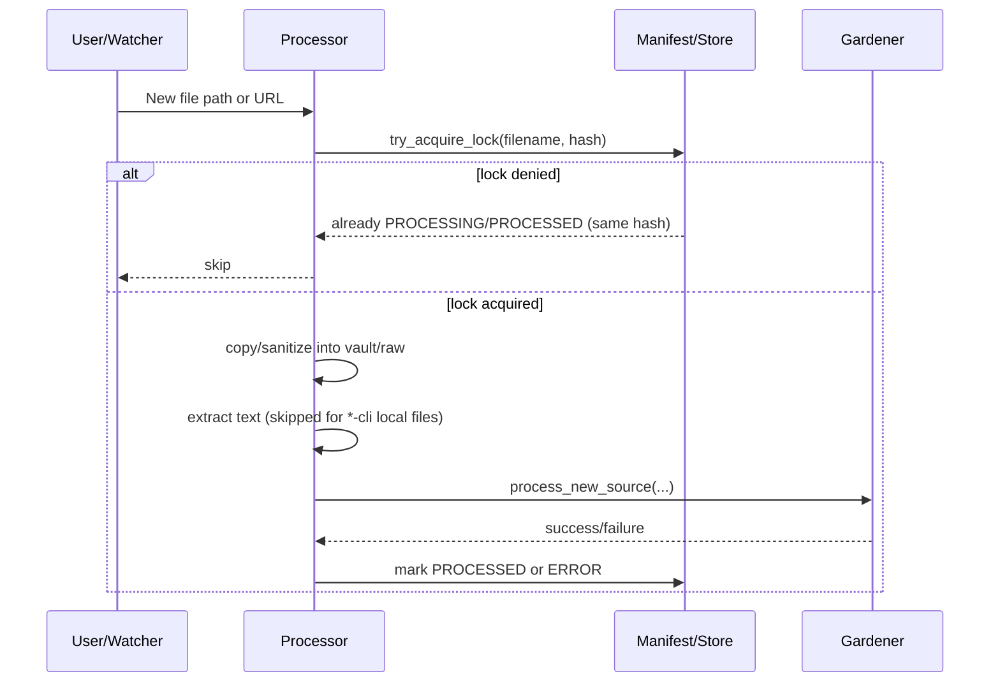
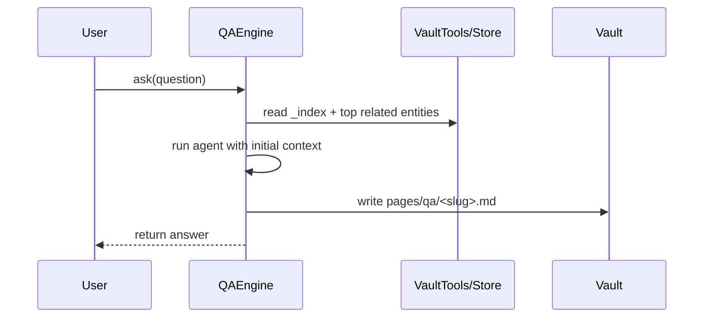

# Agent Workflows

This page maps user-facing workflows to the current runtime behavior.

## Ingest Path (`ingest`, `sync`, `watch`)

## QA Path (`ask`)

## Maintenance and Services

- `maintenance` runs `reflect` -> `evolve` -> `maintain` in a loop with `runtime.maintenance_interval_s` (or `--interval`).
- `dashboard` and `server` update heartbeats; `watch` and `maintenance` also emit heartbeats.
- `up` starts process orchestration only; it does not run `quartz build` automatically.
- `gateway` is optional and only starts when `[gateway].enabled = true`.
